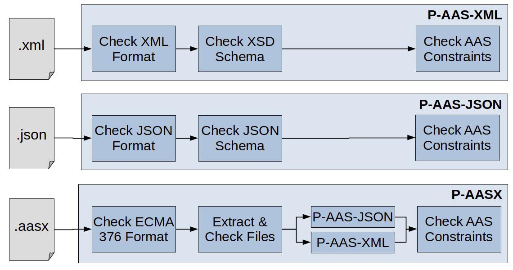

:toc: macro
:sectnums:

include::../shared/doc/cover.adoc[]
<<<
include::../shared/doc/imprint.adoc[]

Recent Revision:

Version history

[width="100%",cols="14%,14%,14%,58%",options="header",]
|===
|*Revision* |*Originator* |*Date* |*CHANGES made*
|0.1 |M. Riedl |2022-04-28 |Start document
|0.2 |B. Otto |2022-05-12 |Initial test case model
|0.3 |M. Riedl |2022-06-08 |Editorial comments / changes
|0.4 |B. Otto |2022-07-20 |Test Profiles
|1.0 |B. Otto |2022-09-01 |Incorporated Review Comments
|===

Referenced documents

[width="100%",cols="46%,14%,17%,23%",options="header",]
|===
|*Document* |*Date* |*Version* |*Remarks*
|Details of the Asset Administration Shell - Part 1 |May 2022 |3.0RC02
|_None_

|ECMA-376, Part 2: Open Packaging Conventions |December 2021 |5^th^
Edition |_None_
|===

<<<

toc::[]

<<<

== Introduction

The following document specifies how test an AAS file representation. An
AAS file representation is usually derived by serializing a model
following the meta-model as defined in the AAS specification [Details of
the Asset Administration Shell - Part 1]. +
By testing this AAS file representation, it’s conformity to the AAS
meta-model is verified. This document specifies which parts of the AAS
meta-model have to be checked by an AAS file testing tool.

== Definitions and Abbreviations

AAS Asset Administration Shell

XML Extensible Markup Language

JSON JavaScript Object Notation

== Test Profiles

The actual testing procedure is selected based on the test profiles.
There are three test profiles which correlate with the actual AAS
serialization formats. The test profiles are described in the table
below.

[width="100%",cols="34%,33%,33%",options="header",]
|===
|Profile |Scope |Test Subject
|P-AAS-JSON a|
Details of the Asset Administration Shell - Part 1

Chapter 9.4

|File containing an AAS serialized in JSON format
|P-AAS-XML a|
Details of the Asset Administration Shell - Part 1

Chapter 9.3

|File containing an AAS serialized in XML format
|P-AASX a|
Details of the Asset Administration Shell - Part 1

Chapter 8

|ECMA-376-2 compliant container, containing an AAS
|===

As it can be seen from the table, the subject for testing is a single
file in either profile.

== Test Results

[#_Toc102577497 .anchor]####Regardless of the actual test profile,
different test steps are carried out during the testing procedure. Each
of these steps has exactly one of the following outcomes:

Table 1: Possible results

[width="100%",cols="54%,46%",options="header",]
|===
|*Result* |*Comment*
|Pass |The test is passed.

|Pass, Hint |The test is passed, but additional information exists. The
information contains issues which do not infer incompliance with the
standard but might do so in the future or for some AAS implementations.

|Fail |The test failed.
|===

The overall test result is then computed in this order:

* if at least one test step is failed, the overall test is flagged as
failed (the test tool is allowed to interrupt the testing procedure at
the failed step)
* if at least one test step is passed with hint, the overall test is
flagged as passed with hint (the test tool shall continue the testing
procedure to the end)
* otherwise, i.e., all steps are passed, the overall test is flagged as
passed

== Testing Procedures

The testing procedure differs according to the profile. The test profile
might be either provided by the user or is selected automatically as
follows:

* if the file ends with .json, P-AAS-JSON is selected
* if the file ends with .xml, P-AAS-XML is selected
* if the file ends with .aasx, P-AASX is selected

An overview of testing procedures for each profile is shown below:

=== Testing Procedure for P-AAS-JSON

Testing a file according to P-AAS-JSON involves the following steps:

First, the file is checked, if it contains JSON formatted content. If
not, this step is flagged as *failed* and testing procedure ends.

Then, the file is loaded and checked against the JSON
schemafootnote:[https://github.com/admin-shell-io/aas-specs/tree/d5d6768cd084d9ed41db6543ceaa442899a08ac0/schemas/json].
This means, in particular:

* if the type (array, string, etc.) of an entity does not match the one
of the schema, the step is considered *failed*
* in case of strings, booleans and numbers:
** the value must have the correct type and one of the available values
if an enum is given in the schema
* in case of objects:
** if the object does not contain all required attributes, the step is
considered *failed*.
** if there are attributes, not specified in the schema, the step is
considered *passed with hint*. The hint shall mention the superfluous
attribute, accordingly.
** finally, each attribute is checked, recursively
* in case of array:
** each entry is checked, recursively

Finally, the AAS constraints are checked as described in corresponding
section 5.4.

=== Testing Procedure for P-AAS-XML

Testing a file according to P-AAS-XML involves the following steps:

First, the file is checked, if it contains XML formatted content. If
not, this step is flagged as *failed* and the testing procedure ends.

Then, the file is loaded and checked against the XSD
schemafootnote:[https://github.com/admin-shell-io/aas-specs/tree/d5d6768cd084d9ed41db6543ceaa442899a08ac0/schemas/xml].
This means, in particular:

* For simple types: if the value does not fit the data format as
specified in the XSD specification, this step is considered *failed*
* For complex types:
** if the object does not contain all required attributes, the step is
considered *failed*.
** if cardinalities (minOccurs, maxOccurs) are not fulfilled, the step
is considered *failed*.
** if there are attributes, not specified in the schema, the step is
considered *passed with hint*. The hint shall mention the superfluous
attribute, accordingly.
** finally, each attribute is checked, recursively

Finally, the AAS constraints are checked as described in corresponding
section 5.4.

=== Testing Procedure for P-AASX

Testing a file according to P-AASX involves the following steps:

First, the file is checked to be an ECMA-376 (part 2) compliant
container. Please refer to the corresponding standard for appropriate
testing procedures. If the container does not follow the ECMA-376
specification, this step is flagged as *failed*, otherwise as *passed*
and the container is unpacked.

Next, the AAS root reference
"http://www.admin-shell.io/aasx/relationships/aasx-origin" is searched.
If it is not present, this step is considered failed and the test is
aborted.

Then all files related to AAS roots are iterated
("http://www.admin-shell.io/aasx/relationships/aas-spec") and for each
part the related split parts
("http://www.admin-shell.io/aasx/relationships/aas-spec-split"). This
means, in particular:

* If the file's mime type is "application/json"
** Check the file extension: if it is '.json', the step is flagged
*passed*, otherwise as *passed with hint* mentioning the missmatching
extension.
** Then the testing procedure for P-AAS-JSON is carried out.
* If the file's mime type is "application/xml”
** Check the file extension: if it is '.xml', the step is flagged
*passed*, otherwise as *passed with hint* mentioning the missmatching
extension.
** Then the testing procedure for P-AAS-XML is carried out.
* Otherwise the file is flagged as *failed*

For each AAS File Submodel, a supplementary file might be loaded
("http://www.admin-shell.io/aasx/relationships/aas-suppl"), if the value
contains an URI. If the URI is invalid or points to an non existing
file, this step is considered *failed*.

In case an identifier is found more than once, the last one shall be
kept, and the corresponding step is considered as *passed with hint*,
where the hint mentions the duplicated identifier.

In case the package is missing a thumbnail, this shall be marked with
*passed with hint*.

Finally, the AAS constraints are checked as described in corresponding
section 5.4.

=== Checking AAS Constraints

The following constraints need to be checked:

[width="100%",cols="50%,50%",options="header",]
|===
|Constraint |Description
|AASd-002 |Referable.id_short shall only feature letters, digits,
underscore ("_"); starting mandatory with a letter. I.e.
[a-zA-Z][a-zA-Z0-9_]+

|AASd-005 |A revision requires a version.

|AASd-014 |Either the attribute globalAssetId or specificAssetId of an
Entity must be set if Entity/entityType is set to “SelfManagedEntity”.
They are not existing otherwise.

|AASd-022 |idShort of non-identifiable Referables shall be unique in its
namespace.

|AASd-051 |A ConceptDescription shall have one of the following
categories: VALUE, PROPERTY, REFERENCE, DOCUMENT, CAPABILITY,
RELATIONSHIP, COLLECTION, FUNCTION, EVENT, ENTITY, APPLICATION_CLASS,
QUALIFIER, VIEW.

|AASd-080 |In case Key/type == GlobalReference, idType shall not be any
LocalKeyType (IdShort, FragmentId)

|AASd-081 |In case Key/type==AssetAdministrationShell Key/idType shall
not be any LocalKeyType (IdShort, FragmentId)

|AASd-090 |For data elements DataElement/category shall be one of the
following values: CONSTANT, PARAMETER or VARIABLE.

|AASd-100 |An attribute with data type “string” is not allowed to be
empty
|===

If any of these constraints is not fulfilled, the test is considered
failed.

Please note, that the table above does not include constraints, which
are not checkable (e.g., if it involves resolving references).

www.industrialdigitaltwin.org
