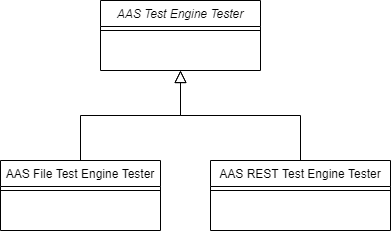

:toc: macro
:sectnums:

include::../shared/doc/cover.adoc[]
<<<
include::../shared/doc/imprint.adoc[]

Recent Revision:

Version history

[width="100%",cols="14%,14%,14%,58%",options="header",]
|===
|*Revision* |*Originator* |*Date* |*CHANGES made*
|0.1 |M. Riedl |2022-04-29 |Start document
|0.2 | | |
|===

<<<

toc::[]

<<<

== Management Summary

The management of a development project greatly increases in complexity
as the number of participating stakeholders. To handle this complexity,
the development process has to be structured and formalized to ensure an
efficient collaboration of all parties. All responsibilities, tasks and
relationships of the participants are written down in the process
description. The main goal is to ensure that all team members know what
to do when and how to communicate their working products among the
project team.

This guideline describes the development process for usage within the
AAS Test Engine Development Project. Described are all roles, their
tasks and the interactions between these roles.

Contractual and commercial aspects are not part of the process
description. It is assumed that they conform to the defined content and
established processes. Responsible for this are the purchaser and the
contractor.

== Definitions and Abbreviations

AAS Asset Administration Shell

CR Change Request

SUT System under Test

TCS Test Case Specification

TCIS Test Case Implementation Specification

TEDG Test Engine Development Group

…

== Introduction

=== Structure of this Document

This document contains several main chapters describing the development
process as well as some appendices with additional information.

At first, the overall project structure with its roles and sub-projects
is given in xxx. The description of all roles participating in the
project is given in xxx. The tasks and communicative interactions of
each role are described there. In xxx the process of the AAS test
project is described in detail. The xxx gives an overview on the
process.

The appendices give additional information that are not essential for
the process itself, but for working according to the process and the
requirements of the IDTA.

=== Modeling and Description Technique

To keep the overview of the whole process description, a formalized
approach to the model is needed. The roles are described in tables,
partly supported by UML diagrams.

==  Definitions

*Change Request* A Change Request (CR) in terms of the process
description is any issue that is tracked on the project server. In a
more concrete meaning, it is the specialization of an issue with a
request to change some feature.

*Feature Request* Specialization of an issue. Requests to implement a
new feature.

*Bug* Specialization of an issue. Reports that something is stopping or
influencing the test execution and should be fixed.

*Sprint Backlog* Summary of all Change Requests, Feature Requests and
Bugs that are treated during this sprint. The sprint backlog is fixed at
the beginning of each sprint.

*IDTA Server* Redmine project administration tool (https://xxx.idta.de)
which contains project “AAS Test Engine”.

NOTE: In the context of this process description the term “Change
Request” is used as a synonym for Change Request, Bug and Feature
Request as they are handled equally by the same process tasks.

Despite that, there is a differentiation between Change Request, Bug and
Feature Request at the IDTA Project Server. This is done because they
differ in criticality and effort, and therefore must be treated
differently during development. Generally, a Bug is more critical than a
Feature Request or Change Request, but it will probably take much less
effort to fix it than to implement a new feature. During prioritization
of the Sprint Backlog, this must be considered.

== Project Structure

To handle the size and complexity of this project, the project structure
defines several project sections and roles. An overview of this
structure is given in Figure 1.

The project consists of two main stakeholders, as there are the Test
Engine Development Group (TEDG) and the Test Group.

The TEDG is the main section of this project and therefore does the
specification and development of the AAS Test Engine.

Corresponding to that, the Test Group does the testing of the AAS Test
Engine and its components.

TEDG and Test Group have subsections, which define a role and its
project participant. The roles and their tasks are described in section
xxx.

The color-coding in Figure 2 will be used as an identifier for each role
in this document. Especially in the process overview in 8 this is
useful. A legend to this color-coding is given in Figure 2.

image::media/structure.svg[image]

[#_Ref102652564 .anchor]####Figure 1: Project Structure

image::media/roles.svg[image]

[#_Ref102653192 .anchor]####Figure 2: Color-coding of roles

== Role Description

=== General

This section describes the project roles with their tasks and their
relationships. It gives advice on what each role must do and when. It
does not give advice on how each task is executed in detail. A general
overview on the roles and their activities is given in xxx. Please
relate during reading the following chapters to the general integration
into the entire structure.

For the concrete role assignment, the reader is referred to [2].

NOTE: The conversations between the participants are realized by the
IDTA Project Server. This way, the communication is made transparent for
all project members. If necessary, direct communication (mail, phone,
etc.) is also possible.

As a special resource the sub-role of the IDTA office is responsible to
host the Project Server. As this task is considered as not so complex
and inherent to the understanding by the TEDG, it is just mentioned here
and nowhere else.

=== Management

==== Project Manager

[#_Toc102663774 .anchor]####Table 1: Description of Project Manager role

[width="100%",cols="17%,83%",]
|===
|*Role* |*Project Manager*

|Description |The Project Manager organizes and manages the project and
its participants

|Tasks a|
* {blank}
+
____
Definition of Project Schedule
____
* {blank}
+
____
Organization of Project Meetings
____
* {blank}
+
____
Approval of Beta Release
____
* {blank}
+
____
Distribute the released Test Bundle to Project Supervisor
____

|Conversation |—
|===

==== Project Supervisor

[#_Toc102663775 .anchor]####Table 2: Description of Project Supervisor
role

[width="100%",cols="17%,83%",]
|===
|*Role* |*Project Supervisor*

|Description |The Project Supervisor is the administrative entity and
customer of the whole project.

|Tasks a|
* {blank}
+
____
Supervise the entire project
____
* {blank}
+
____
Manage the IDTA Project Server
____

|Conversation |—
|===

==== Quality Manager

[#_Toc102663776 .anchor]####Table 2: Description of Quality Manager role

[width="100%",cols="17%,83%",]
|===
|Role |Quality Manager

|Description |The Quality Manager describes and supervises the process
and its execution.

|Tasks a|
* {blank}
+
____
Create the process description
____
* {blank}
+
____
Monitor the process execution
____

|Conversation a|
Publish the process definition to:

* Project Manager
* Project Supervisor
+
Report the process quality:
+
Project Manager
+
Project Supervisor

|===

NOTE: To properly monitor the process execution there should be a
regular meeting of Project Supervisor, Project Manager and Quality
Manager. These meetings are organized by the Quality Manager.

=== Requirements Specification

==== IDTA WG x (Marketing?)

[#_Toc102663777 .anchor]####Table 4: Description of IDTA WG x
(Marketing?) role

[width="100%",cols="17%,83%",]
|===
|*Role* |*C1 PN Marketing*
|Description |The IDTA WG provides CRs and reviews Test Cases
|Tasks a|
* {blank}
+
____
Review:
____
** {blank}
+
____
Test Case Specification
____
** {blank}
+
____
Test Case Implementation Specification
____
* {blank}
+
____
Generate Change Requests
____
* {blank}
+
____
Provide Change Requests
____

|Conversation |Inform TEDG about new CRs
|===

==== IDTA WG y (Marketing?)

==== IDTA WG z (Marketing?)

=== AAS Test Engine Development

To simplify the process description given in this document the different
AAS Test Engine Developments for the sub-projects have been generalized
into the role of the AAS Test Engine Development.

Each of the roles of the sub-projects has the same activities and
communicates the same messages. The only difference between them is the
connection to the specific sub-project and its technical artifacts. The
communication of messages therefore takes place between the
sub-project-specific roles where applicable.

[#_Toc102663778 .anchor]####Table 5: Description of AAS Test Engine
Development role

[width="100%",cols="17%,83%",]
|===
|*Role* |*AAS Test Engine Development*

|Description |The AAS Test Engine Development Group develops the AAS
Test Engine and the TCIS and distributes the Beta Release at the IDTA
Project Server.

|Tasks a|
* {blank}
+
____
Develop the AAS Test Engine:
____

* Test Case Implementation Specification (TCIS)
* Implementation
* Integration Test of the AASTest Engine

* {blank}
+
____
Provide Beta Release at the IDAT Project Server
____
* {blank}
+
____
Provide Test Case Implementation Specification at the IDTA Project
Server
____

|Conversation a|
Inform about new Beta Release:

* Technology Provider
* IDTA WG x y z
* Test Engine Tester
* Test Bundle Engine Tester
+
Inform about new Implementation Specification:

* Technology Provider
* IDTA WG x y z

|===

=== Testing

==== AAS Test Engine Tester

To simplify the process description given in this document the different
AAS Test Engine Testers for the sub-projects have been generalized into
the role of the AAS Test Engine Tester, see Figure 3.

Each of the roles of the sub-projects has the same activities and
communicates the same messages. The only difference between them is the
connection to the specific sub-project and its technical artifacts. The
communication of messages therefore takes place between the
sub-project-specific roles where applicable.

To get significant test results the test bed of the sub-projects shall
contain a reasonable number of SUT of different vendors. An exchange of
experiences regarding the test bed between the AAS Test Engine Testers
is assumed.

[#_Ref102657099 .anchor]####Figure 3: AAS Test Engine Tester and its
sub-roles

[#_Toc30399312 .anchor]####Table 6: Description of AAS Test Engine
Tester Role

[width="100%",cols="18%,82%",]
|===
|*Role* |*AAS Test Engine Tester*

|Description |The AAS Test Engine Tester tests the AAS Test Engine Beta
Release and reviews the Test Case Specification & Implementation
Specification

|Tasks a|
* {blank}
+
____
Test of Beta Release
____
* {blank}
+
____
Review:
____
** {blank}
+
____
Test Case Specification
____
** {blank}
+
____
Test Case Implementation Specification
____
* {blank}
+
____
Provide CRs to TEDG
____

|Conversation a|
* {blank}
+
____
Inform TEDG about new CRs
____
* {blank}
+
____
Inform Project Manager about Test Result of Beta Release
____

|===

==== Test Bundle Engine Tester

The System Test is a final test of the AAS Test Bundle before its
release. This test is intended to ensure that each component of the AAS
Test Bundle can be used.

The functional testing is not part of the System Test, e.g. whether test
cases are implemented correctly. This task is done by other tester
roles.

Main tasks of the System Test are:

* Is the bundle available (e.g. via download from IDTA Server)?
* Are all files or services available and all filenames correct?
* Are all parts included as defined?
** Documentation
** Readme
** Software
* Are there any version mismatches between software and user
documentation?
* Does the bundle can be used correctly?
* Is the installation manual clear? (if needed)
* Do all Test Tools install?
* For all Test Tools / Services:
** Does it run?
** Is there a description, how to run a test?
** Is this description understandable and correct?
** Is there a description, where the test results are saved?
** Is this description understandable and correct?
** Is an exemplary test case executable?
* Is there a description, what must be done in the case of an error?
* Documentation of the test results.

*NOTE:* The Test Bundle Contents are described in Annex C.

[#_Toc102663780 .anchor]####Table 7: Description of Test Bundle Engine
Tester Role

[width="100%",cols="17%,83%",]
|===
|*Role* |*Test Bundle Engine Tester*
|Description |The Test Bundle Engine Tester tests the AAS Test Bundle
|Tasks a|
* {blank}
+
____
System Test of AAS Test Bundle
____
* {blank}
+
____
Provide CRs to TEDG
____

|Conversation a|
* {blank}
+
____
Inform TEDG about new CRs
____
* {blank}
+
____
Inform Project Manager about test result of the System Test
____

|===

==== Technology Provider

[#_Toc102663781 .anchor]####Table 8: Description of Technology Provider
Role

[width="100%",cols="17%,83%",]
|===
|*Role* |*Technology Provider*

|Description |The Technology Provider tests the Beta Release and does
Reviews

|Tasks a|
* {blank}
+
____
Test of Beta Release
____
* {blank}
+
____
Review:
____
** Test Case Specification
** Test Case Implementation Specification
* {blank}
+
____
Provide CRs to TEDG
____

|Conversation |Inform TSDG about new CRs
|===

== TEDG Project Process Description

=== Overview

The TEDG Project Process defines a three-monthly release cycle. This
quarterly release cycle includes two months of development and one month
of testing of the Release Candidate.

At the end/beginning of each release cycle is a kickoff meeting where
the previous release cycle is summarized, and the next cycle is
prepared. The main purpose of this meeting is the definition of the
backlog for the next quarter. Additionally, there are monthly meetings
for smaller discussions and minor adjustments.

In the last third of the release cycle there is the test phase in which
all parts of the AAS Test Engine shall be tested. Also, a Test Bundle
Engine Test shall test the Test Bundle and its correct creation.

The AAS Test Bundle contains all parts of the AAS Test Engine as well as
the additional external project artifacts (if exist). This external
project artifact is not part of the TEDG development and qualified
testing. This Test Bundle is called Beta Release.

During the test phase there may be a short bugfix phase. This phase
shall last no longer than two weeks and could postpone the release date
by its duration. For scheduling this bugfix phase a deadline for bug
reporting is defined by the TEDG.

At the end of a release cycle a AAS Test Bundle, containing the
bugfixes, is created. This Test Bundle is called Release Candidate (RC).

Once a year there will be an official IDTA-Release, for which the latest
Release Candidate is named “Release”.

The main tool to handle the CRs for current/next cycles is the backlog.
Each of the cycle has its own backlog assigned containing the relevant
CRs. Additionally, the backlog of the next cycle is prepared at the
beginning of the current cycle. This way, there is no work stop for the
development group while the Beta Release is under test.

=== Provide CRs to TEDG

One of the often-repeated tasks in this project is providing the Change
Requests to the TEDG.

The Change Requests are provided and published to the IDTA Project
Server.

The TEDG will then prioritize the Change Requests during the next Beta
Release kickoff meeting.

NOTE: To simplify the prioritization task, all stakeholders who provide
CRs shall also give a pre-prioritization for their CRs. The review of
the CRs shall be done by the role assigned to each CR.

NOTE: A description of the management of Change Requests via the IDTA
Project Server is given in Annex A.2.

NOTE: All necessary information, e.g. report and project file shall be
attached to the Change Request. In case of missing information, the
Change Request is set to the state “On Hold”. If there is no reaction
regarding requests to this from the reporter within 2 months, the Change
Request will be closed.

=== Collect and Prioritize Product Backlog

To get a reliable set of requirements for the next sprint, the Change
Requests must be prioritized and approved. This is done during the
sprint kickoff meeting.

For this task, it is important to separate new CRs from prioritized ones
of the current sprint. To do this, it is common to use the so-called
Product Backlog as a collection of all change requests and the Sprint
Backlog that means a prioritized set of change requests.

New change requests only affect the Product Backlog, while the Sprint
Backlog remains fixed during the sprint.

The Sprint Backlog shall only have entries that can be done in the time
of the current sprint.

The development team shall only work on entries of the Sprint Backlog.

The management of Product and Sprint Backlog can be done easily via the
project management tool. To display the Sprint Backlog, there shall be
an appropriate filter for the Product backlog.

The Sprint Backlog is separated into two parts, one for the current
sprint and one for the upcoming sprint. This way, the development groups
always have some sprint entries to work on, even if the current
development cycle is finished and the test group is testing the Beta
Release Candidate.

The backlog for the current sprint is approved and therefore fixed in
the sprint kickoff meeting, while the backlog for the upcoming sprint is
proposed in the same sprint kickoff meeting. This proposed backlog may
be changed in the next sprint kickoff meeting, where it will be
approved.

The Sprint Backlog is also separated into the different sub-projects of
the AAS Test Engine (for the current and upcoming sprint).

The TEDG manages all Sprint Backlogs and synchronizes them with its
overall feature set for the next release.

=== Test Case Specification

The specification of the test cases based on the entries of the Sprint
Backlog includes the generation of new test cases as well as the
modification of existing ones. At the end, all test cases shall be
passed to the test system development.

Also, there is a review on the test case specification to generate new
CRs for the next sprint.

=== AASTest Engine Development

The AAS Test Engine Development is the implementation and integration of
the test cases into the AAS Test Engine.

At the end of the sprint, the test engine development shall be finished,
and all entries of the Sprint Backlog are closed. Any open entries of
the Sprint Backlog are treated as new CRs in the product backlog.

At the end/beginning of each release cycle, the developed AAS Test
Engine forms the Beta Release and is therefore published to the test
groups.

The Review of TCS and TCIS shall be done by the corresponding Tester
Roles. That means that the AAS Test Engine TCIS shall be reviewed by the
AAS Test Engine Tester, the AAS File Test Engine Tester reviews AAS File
test TCIS and for the REST TCIS the AAS REST Test Engine Tester is
responsible.

For the Review of the TCS, one dedicated party is responsible. Who does
this Review is defined by the TEDG.

The following roles should do a Review of TCS and TCIS:

* IDTA WG x y z
* Technology Provider

All other TEDG members may participate in the Review.

For each Review, a fixed Review period of two weeks is maintained to
give all Review participants enough time. At the end of the Review, at
least the mandatory Reviewer shall give a comment on the reviewed
documents, even if it is just “no objections”.

NOTE: A description of the online Review process is given in Annex Annex
A.1.

=== Secure consistency of TCS and TCIS

Because of integration of CRs against TCS also a change in the TCIS may
be necessary and vice versa.

After the Review of the TCS is finished the Test Case Specifier shall
create a CR against the TCIS (AAS Test Engine Development) if needed.

After the Review of the TCIS is finished the AAS Test Engine Development
shall create a CR against the TCS (Test Case Specifier) if needed.

This process guarantees the consistency of TCS and TCIS.

NOTE: There may be smaller changes on TCS/TCIS, which does not require
to do a Review. For these changes the same process shall be used.

=== Need for a Hotfix Test Bundle

Because of one or more severe bug(s), the need for a Hotfix could arise.
To find a final decision is the task of the TEDG. The decision-making is
initiated by the Project Manager. In general, the owner of the bug, the
assignee, the Project Supervisor, IDTA WG xzy and the Quality Manager
will participate the decision-making.

The bug report shall state the following:

* Significant description
* Effect (which/how many customers are affected by this bug)
* Possible workarounds
* Impact analysis regarding the changed lines of code

The necessary tests will be executed by the AAS Test Engine Testers of
the affected sub-project. To save test effort only the affected
components of the Test Bundle should be exchanged. All other components
remain on the latest version, which was published on the website of
IDTA.

A released Hotfix Test Bundle replaces the latest AAS Test Bundle on the
website of IDTA. The Hotfix Test Bundle is valid until the next Hotfix
Test Bundle or the next regular AAS Test Bundle will be released.

=== Test of Beta Release 

In each release cycle, there is the testing and approval of the Beta
Release.

The Testing is done by all Test Group Participants (see section 6.5.1).

The Test Group may create change requests from the test, which will be
handled for the next cycle.

Qualified Testing and Approval of the Test Bundle Parts is done by the
corresponding tester roles. The other tester roles (Technology Provider)
shall also test the AAS Test System, but don’t do an approval of the
Test Bundle Parts.

The System Test of the Test Bundle that includes all AAS Test Engine
Components is done separately by the Test Bundle System Tester.

Despite that, all TEDG members may test the AAS Test Engine and its
parts to provide Change Requests.

NOTE: The scope and quality of these tests should be defined and managed
by the TEDG.

=== Approval and Release

As soon as a Beta Release is tested by the Test Bundle System Tester, it
can be released in an AAS Test Bundle. This is done by the Project
Manager and provided as a recommendation for a release at the IDTA
Project Server.

The final approval and release of the AAS Test System as the official
AAS Test Bundle on the IDTA Server is not part of the TEDG process.

== Description of the Review Process

=== Online PDF-Review via IDTA Server

The online PDF-Review is an essential part of the overall Review
Process. Since it is so important, in this Annex an introduction on how
to use the online PDF-Review is given.

In contrast to classical Word-document-based Reviews, the online
PDF-Review uses a centralized concept to manage the document under
Review as well as all Review comments.

Using this concept, all Review Documents are provided and managed via
the IDTA Server. During the Review Process, all comments made to the
document under Review are stored on the IDTA Server. This way, all
Review participants see the comments of all other reviewers and may
respond to these comments.

To establish the Review, the documents must be prepared with Adobe
Acrobat. To simplify this process, IDTA offers the creation of the
Review-document. To do this, IDTA needs the Word Document (.doc/.docx)
as a source. All Review documents will then be published on the IDTA
Project Server.

After review is finished, the document with review comments from all
reviewers is available on the IDTA Project Server without additional
interaction. After the review is finished, the author of the document
shall reply to each of the comments and provide a finalized review
document with comments and replies.

NOTE: On the IDTA Server the documents, which are currently under
review, can be found at https://url. Besides that, access to all
documents is provided via the IDTA Project Server, which can be found at
https://url/.

NOTE: Adobe Acrobat Reader Version 10 (or higher) is needed to
participate in the PDF-Review.

NOTE: The following login information is needed to participate in the
Review:

Username: TsReview

Password: review2015-!

NOTE: Adobe Acrobat Reader asks for Username, Company and E-Mail address
prior to first review. Everybody shall use his full name, company name
and E-Mail address to log in for review.

NOTE: Anonymous review comments are not allowed and will be deleted.

=== CR Management and Review of CRs

All Change Requests that are managed by the IDTA Project Server
experience a certain lifecycle. This lifecycle mainly consists of the
phases Creation, Processing, Review and Termination.

The phases of this lifecycle correspond with the states of a CR that are
used on the IDTA Project Server.

Figure t.b.d shows the state machine of the CR lifecycle, whereas the
states are the CR states on the IDTA Project Server, and the Transitions
depict the Lifecycle phases. Inside each of the states, the role which
is responsible to set this state and work on the corresponding lifecycle
phase is given.

Processing of the CR is done by the Assignee. Creation and Review is
done by the Author of the CR. Termination is done automatically by
storing the information on the IDTA Project Server.

After the CR is implemented by the Assignee, it is re-assigned to its
original Author for the Review and Verification Phase. This is done by
the original Assignee who implemented the CR. Sometimes the CR
processing must be stopped because a general concept decision from the
TEDG is needed. In this case the state is changed to “TEDG Decision
needed”. A CR which cannot be realized for the next PI Release must be
changed to the state “Deferred”. After a PI release all CRs in the state
“Deferred” must be evaluated again.

The transition auto-close is a special case where the Review process is
skipped because there has been no action by the Reviewer (the Author of
the CR) after the Processing has been finished. The Author has a period
of two months to review the realization of the CR before the CR is auto
closed.

Basically, two roles can execute the auto-close on the Project Server.
These are the Project Leader corresponding to the sub project of the CR
and the Quality Manager. In priority the Project Leader should do this.

To make sure that there are no CRs without any role assigned to it,
there are three rules for assigning CRs:

[arabic]
. The Project Leader will look for unassigned CRs and assign the correct
person.
. The CR originator enters the Project Leader as assignee.
. The Project Leader may assign already assigned CRs of his project to
the correct person.

== Numbering and Versioning schemes

=== TCS/TCIS numbering scheme

To avoid any ambiguity between the AAS and Infrastructure test cases of
the aspects and each of the sub-projects, the Test Case numbering scheme
as given in Table 9 shall be used. In correspondence to the hexadecimal
numbering, a decimal numbering with the same values can be used.

[#_Ref102663713 .anchor]####Table 9: Test Case numbering scheme

[width="100%",cols="34%,33%,33%",options="header",]
|===
|AAS / Infrastructure test |*Sub-Project* |*Value*
|AAS and common tests |AAS File test cases |0x0 to 0x3FF
| |AAS REST test cases |0x400 to 0x7FF
| |??? |0x800 to 0xBFF
| |??? |0xC00 to 0xFFF
| |??? |0x2000 to 0x27FF
|Inftrstructure tests |??? |0x1000 to 0x13FF
| |??? |0x1400 to 0x17FF
| |??? |0x1800 to 0x1BFF
|===

=== File Versioning scheme

To identify each of the files provided in the project, the Versioning
Scheme given in Table 9 shall be used.

To separate the different sections of the versioning scheme, the
following characters should be used: “_-.#”. The separating character
between version type and Main may be omitted.

Files that contribute to a certain version of the Test Engine shall
state this as their Version number.

The Build section is just for internal purpose to distinguish two
software build states. Therefore, they may be deleted in the Software
Release. Nevertheless, they should be noticed as corresponding to this
Release.

The sections of the versioning scheme are also different for the
document types because of their specific uses and release cycles.

[#_Ref102663757 .anchor]####Table 9: File Versioning Scheme

[width="99%",cols="15%,10%,52%,4%,6%,6%,7%",options="header",]
|===
|Section |*Example* |*Comment* |*TE* |*TCS* |*TCIS* |*Build*
|Type |“V…” |common values: “d”-Draft, “V”-Release |M |M |M |M

|Main |“2” |defined by TEDG |M |M |M |M

|Sub |“32” |defined by TEDG |M |M |M |M

|Increment |“1” |defined by TEDG |- |O |M |M

|Build |“xxxxx” |defined by sub-project itself (mainly used for SW
builds; may be deleted for Release) |- |O |O |M(d)

|*M – mandatory; O – optional; M(d) – mandatory for Draft, optional for
Release* | | | | | |
|===

Examples of Document File names:

* Process Description, Draft Version for Version 0.12.3 of the AAS Test
System, Build number 0815: “Process Description_d0.12.3.0815.docx”
* Process Description, Release Version corresponding to Version 1.00.0
of the AAS Test Engine: “Process Description_V1.00.0.docx”

== Test Bundle contents

The Test Bundle contains the following Components:

* TCS documents
* AAS Test Engine
* Guidelines and Specifications
* Quality Documents

Additional Test Bundle Components that do not underlie the TEDG
Development Cycles:

* -

Each of the Components above shall contain the following documents:

* Manual
* TCIS
* Changelog
* Known Bugs and Workarounds

There shall also be a document that contains a mapping table for these
documents where the correct filenames are mapped to the documents. This
table may be part of the manual.

www.industrialdigitaltwin.org
